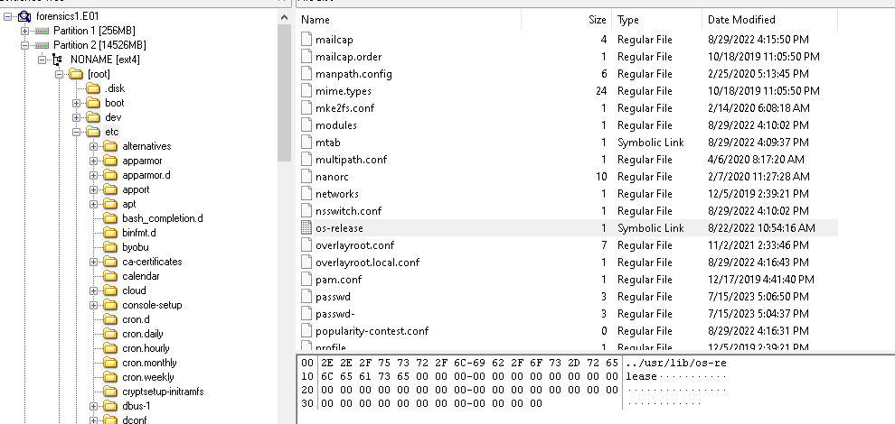
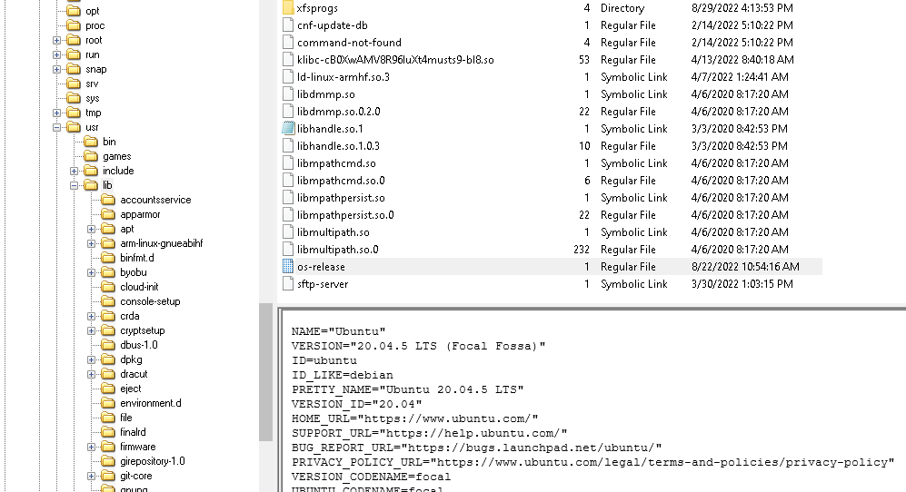
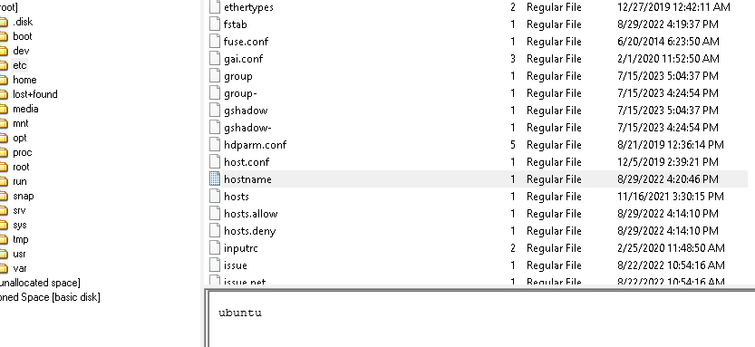

## title: Device Info (ep1) | 50 points | forensics | 109 Solves

**Resolver:** Yxzi

## description:

Can you find the operating system information?

## Solution

We got ziped file with binary disk dump. The creators of task asks for name of this system, more precisely for name and version, for find this information from disk image we will be must use some tool for analyzing disks dumps (I will be using FTK images)

<code>[23:15:43]:[yxzi@HACKERMAN]$ file forensics1.E01
forensics1.E01: EWF/Expert Witness/EnCase image file format</code>

After load this image to FTK imager it turns out it's some linux system, probably ubuntu. Firstly i looked at /etc/os-release file this file often contain informations about OS, but In this case it contained location to "os-release" binary file: (/usr/bin/os-release).

    

Content of this binary file contained data which I was looking for:

    

## title: Device Info (ep2) | 50 points | forensics | 50 Solves

**Resolver:** Yxzi

## description:

Can you find the device ip and hostname?

This challenge it's the same as previous, we have the same disk image. The host name is simpler to find than ip address. I just opened the /etc/hostname file and there was hostname.

    

IP address of interfaces can be in logs, more precisely /var/log/boot.log because in every boot process all informations about booting also information about running network interfaces with their in configuration are saved in this file. I greped for "Net device info" from the bottom of the file
 because there is the most latest informations:

<code>[   24.556574] cloud-init[609]: ci-info: | wlan0  |  True |               192.168.1.72              | 255.255.255.0 | global | b8:27:eb:ab:d6:4f |</code>

# the flag: CyberGonCTF{192.168.1.72_ubuntu}

## title: Device Info (ep3) | 50 points | forensics | 40 Solves

**Resolver:** Yxzi

## description:

Can you find the first connected WiFi (SSID) and password?

/var/log/syslog i searched for "SSID" string, the fist found string is probably first connected wifi network "Ko_Koe_Lo_Ko_Ko".

<code>[23:15:43]:[yxzi@HACKERMAN]$ grep -i 'SSID' syslog
Aug 29 16:28:36 ubuntu wpa_supplicant[1586]: wlan0: Trying to associate with SSID 'Ko_Koe_Lo_Ko_Ko'
Jul 15 12:43:30 ubuntu wpa_supplicant[501]: wlan0: Trying to associate with SSID 'Ko_Koe_Lo_Ko_Ko'
Jul 15 12:48:54 ubuntu wpa_supplicant[512]: wlan0: Trying to associate with SSID 'Ko_Koe_Lo_Ko_Ko'
Jul 15 12:52:18 ubuntu wpa_supplicant[512]: wlan0: CTRL-EVENT-DISCONNECTED bssid=82:36:63:a2:b1:96 reason=1 lo
cally_generated=1
Jul 15 12:56:45 ubuntu wpa_supplicant[1158]: wlan0: Trying to associate with SSID 'Gangsters_2.4G'
Jul 15 13:21:49 ubuntu wpa_supplicant[508]: wlan0: Trying to associate with SSID 'Gangsters_2.4G'</code>

Passwords to wifi networks are stored in network connfiguration files, more precisely: /etc/netplan/. In this case password for this network was saved in this file: /etc/netplan/50-cloud-init.yaml

<code># This file is generated from information provided by the datasource.  Changes
# to it will not persist across an instance reboot.  To disable cloud-init's
# network configuration capabilities, write a file
# /etc/cloud/cloud.cfg.d/99-disable-network-config.cfg with the following:
# network: {config: disabled}
network:
    ethernets:
        eth0:
            dhcp4: true
            optional: true
    wifis:
        wlan0:
            dhcp4: yes
            access-points:
                "Ko_Koe_Lo_Ko_Ko":
                    password: "Ah_Nge_Chaw_Yal_Tae_Inn_Tae"
                "Gangsters_2.4G":
                    password: "N41ng-Ny1"
    version: 2

</code>

the flag: CyberGonCTF{Ko_Koe_Lo_Ko_Ko_Ah_Nge_Chaw_Yal_Tae_Inn_Tae}

## title: Device Info (ep4) | 50 points | forensics | 33 Solves

**Resolver:** Yxzi

## description:

Can you find the device model details of this host? | Flag Format: CyberGonCTF{Full Information} #included Device Name, Series Number, Model, Version example flag - CyberGonCTF{ThinkPad X1 Carbon Gen 11}

Catalogs as "/proc", "/dev" or "/sys" are empty so the fastest way to find device name is again greping /var/log/syslog.

I just greped for "model" string in syslog file:

<code>[23:15:43]:[yxzi@HACKERMAN]$ grep -i 'model' syslog
Aug 29 16:20:54 ubuntu kernel: [    0.000000] OF: fdt: Machine model: Raspberry Pi 3 Model B Rev 1.2
Jul 15 12:43:30 ubuntu kernel: [    0.000000] OF: fdt: Machine model: Raspberry Pi 3 Model B Rev 1.2
Jul 15 12:48:54 ubuntu kernel: [    0.000000] OF: fdt: Machine model: Raspberry Pi 3 Model B Rev 1.2
Jul 15 12:54:13 ubuntu kernel: [    0.000000] OF: fdt: Machine model: Raspberry Pi 3 Model B Rev 1.2
Jul 15 13:21:49 ubuntu kernel: [    0.000000] OF: fdt: Machine model: Raspberry Pi 3 Model B Rev 1.2
</code>

the flag: CyberGonCTF{Raspberry Pi 3 Model B Rev 1.2}

## title: Attacker IP (ep5) | 50 points | forensics | 32 Solves

**Resolver:** Yxzi

## description:

What is the ip address of Attacker? He tried to log on to this machine.

In this case I was greaping in /var/log/auth.log, for anomaly where some ip address, many times try to login to machine. I search for "failure" string in log file and I noticed that server returned many failures in authentication to "192.168.1.67" ip.

<code>[23:15:43]:[michal@HACKERMAN]$ grep -i 'failure' auth.log
Jul 15 14:20:31 ubuntu sshd[1093]: pam_unix(sshd:auth): authentication failure; logname= uid=0 euid=0 tty=ssh
ruser= rhost=192.168.1.67  user=ubuntu
Jul 15 14:20:48 ubuntu sshd[1093]: Disconnecting authenticating user ubuntu 192.168.1.67 port 44008: Too many
authentication failures [preauth]...</code>

<code>[23:15:43]:[michal@HACKERMAN]$ grep -i 'failure' auth.log  | wc -l
332</code>

flag: CyberGonCTF{192.168.1.67}

## title: Success Logon (ep6) | 50 points | forensics | 27 Solves

**Resolver:** Yxzi

## description:

Do you know the total number of failed logon from attacker and When attacker got the success? | Flag Format: CyberGonCTF{total failed numbers_Mon dd hh:mm:ss} eg. CyberGonCTF{10_Jan 01 01:01:01}

Firstly i dumped /var/log/auth.log from disk image on my disk. If user trying to login and he fails the sshd server logs it in auth.log file and we can find this loged information as this string: "Failed password for ubuntu from"

If user succesfully login, sshd server saved information in logs as string: "Accepted password for ubuntu from"

We know attacker ip address: 192.168.1.67, the first successfuly login to machine from attacker ip was logged:

<code>Jul 15 16:54:25 ubuntu sshd[1896]: Accepted password for ubuntu from 192.168.1.67 port 44710 ssh2</code>

The second stage of this task is to caluclate how many times attacker failed in logon. Its just calculate how many times appears string "Failed password for ubuntu from 192.168.1.67", I wasm use python script for this task:

<code>#!/usr/bin/python3

string = "Failed password for ubuntu from 192.168.1.67"
counter = 0

with open("auth.log", "r") as file:
	lines = file.read().splitlines()
	for line in lines:
		if string in line:
			counter += 1

	file.close()

print(counter)</code>

<code>[00:35:10]:[michal@HACKERMAN]$ python3 solver.py
652</code>

the flag: CyberGonCTF{652_Jul 15 16:55:26}
