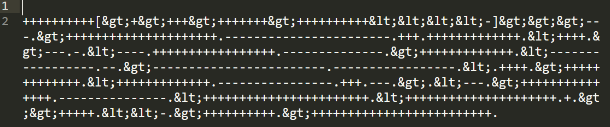

## title: Hide and Seek | 100 points | forensics | 98 Solves

**Resolver:** Yxzi

## description:

Our SOC team detected a data exfiltration case where an employee from the sales department uploaded some files to his personal cloud storage every day this week. After checking all the files, we have suspected one file is Secret_File.docx. Can you help us find the secret data in this file?

## Solution:

This document doesn't containg any macros or something like that, I veryfied this using oletools. When we open document in hex editor on the end of file we can see that its OOXML file, because document contains paths to xml files inside:

<code>000051c0  00 00 00 00 32 2d 00 00  77 6f 72 64 2f 74 68 65  |....2-..word/the|
000051d0  6d 65 2f 74 68 65 6d 65  31 2e 78 6d 6c 50 4b 01  |me/theme1.xmlPK.|
000051e0  02 2d 00 14 00 06 00 08  00 00 00 21 00 10 9b 5c  |.-.........!...\|
000051f0  d1 cc 04 00 00 8c 0e 00  00 11 00 00 00 00 00 00  |................|
00005200  00 00 00 00 00 00 00 37  34 00 00 77 6f 72 64 2f  |.......74..word/|
00005210  73 65 74 74 69 6e 67 73  2e 78 6d 6c 50 4b 01 02  |settings.xmlPK..|
00005220  2d 00 14 00 06 00 08 00  00 00 21 00 42 d4 e8 5d  |-.........!.B..]|
00005230  fe 0c 00 00 11 7c 00 00  0f 00 00 00 00 00 00 00  |.....|..........|
00005240  00 00 00 00 00 00 32 39  00 00 77 6f 72 64 2f 73  |......29..word/s|
00005250  74 79 6c 65 73 2e 78 6d  6c 50 4b 01 02 2d 00 14  |tyles.xmlPK..-..|
00005260  00 06 00 08 00 00 00 21  00 ef 0a 29 4e 4e 01 00  |.......!...)NN..|
00005270  00 7e 03 00 00 14 00 00  00 00 00 00 00 00 00 00  |.~..............|
00005280  00 00 00 5d 46 00 00 77  6f 72 64 2f 77 65 62 53  |...]F..word/webS|
00005290  65 74 74 69 6e 67 73 2e  78 6d 6c 50 4b 01 02 2d  |ettings.xmlPK..-|
000052a0  00 14 00 06 00 08 00 00  00 21 00 78 d3 61 5a 15  |.........!.x.aZ.|
000052b0  02 00 00 7f 07 00 00 12  00 00 00 00 00 00 00 00  |................|
000052c0  00 00 00 00 00 dd 47 00  00 77 6f 72 64 2f 66 6f  |......G..word/fo|
000052d0  6e 74 54 61 62 6c 65 2e  78 6d 6c 50 4b 01 02 2d  |ntTable.xmlPK..-|
000052e0  00 14 00 06 00 08 00 00  00 21 00 ae da f4 f4 7a  |.........!.....z|
000052f0  01 00 00 eb 02 00 00 11  00 00 00 00 00 00 00 00  |................|
00005300  00 00 00 00 00 22 4a 00  00 64 6f 63 50 72 6f 70  |....."J..docProp|
00005310  73 2f 63 6f 72 65 2e 78  6d 6c 50 4b 01 02 2d 00  |s/core.xmlPK..-.|
00005320  14 00 06 00 08 00 00 00  21 00 bb 82 16 a0 d1 01  |........!.......|
00005330  00 00 d8 03 00 00 10 00  00 00 00 00 00 00 00 00  |................|
00005340  00 00 00 00 d3 4c 00 00  64 6f 63 50 72 6f 70 73  |.....L..docProps|
00005350  2f 61 70 70 2e 78 6d 6c  50 4b 05 06 00 00 00 00  |/app.xmlPK......|</code>

I used unzip tool to extract this files:

<code>
[11:19:51]:[michal@HACKERMAN]$ unzip -qq Secret_File.docx -d output
[11:19:51]:[michal@HACKERMAN]$ tree output/
output/
├── [Content_Types].xml
├── _rels
├── docProps
│   ├── app.xml
│   └── core.xml
└── word
    ├── _rels
    │   └── document.xml.rels
    ├── document.xml
    ├── endnotes.xml
    ├── fontTable.xml
    ├── footnotes.xml
    ├── header1.xml
    ├── settings.xml
    ├── styles.xml
    ├── theme
    │   └── theme1.xml
    └── webSettings.xml
	\n
</code>

in word/header1.xml file we can find some string which looks like brainfuck language with some entity characters:

    

strings like this: "gt;" and this "lt;" are entities which reprezents "<" and ">" chars

We can replace this entity representations with this python script:

<code>
#!/usr/bin/python3
output = open("output.txt", "w")
with open("brain_funck.txt", "r") as file:
	lines = file.read().splitlines()
	line = lines[0]
	new_line = line.replace("gt;", ">")
	new_line = new_line.replace("lt;", "<")
	output.write(new_line)
		\n
</code>

Output from this script must be executed in brainfuck interpreter, i use this tool: "https://www.dcode.fr/brainfuck-language"

Brainfuck interpreter returns flag for us: CyberGonCTF{53cR37_D474_1n_H34d3R}
